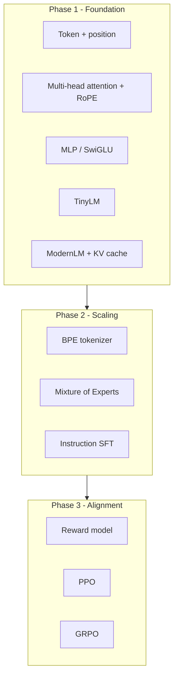

# Architecture

Roughly how the three phases fit together, and why I made the choices below.

## Overview



## ModernLM block

Each `ModernLayer` applies pre-norm attention and FFN:

1. RMSNorm → `ModernAttn` (RoPE, optional GQA, KV cache for generation)
2. Residual
3. RMSNorm → `GatedFFN` (SwiGLU)
4. Residual

`TinyLM` uses learned positional embeddings and standard LayerNorm. It is a simpler baseline before the modern stack.

## MoE routing

`MixtureOfExperts` picks top-k experts per token via a learned gate. An auxiliary load-balancing loss encourages even expert use.

## Alignment

1. **Reward model**: `PreferenceScorer` plus Bradley-Terry loss on chosen/rejected pairs.
2. **PPO**: clipped policy objective with a value head (`ActorCritic`).
3. **GRPO**: group-relative policy optimization without a separate value network.

## Design choices

| Choice | Why |
|--------|-----|
| RoPE over learned positions | Better length generalization, no extra embedding table at inference |
| GQA | Fewer KV heads → less memory during generation |
| Byte-level vocab (256) for demos | No tokenizer file needed for parts 1-3 |
| BPE in part 4+ | Closer to production tokenization |

## Code map

```
baremetal_llm/
  foundation.py   # transformers, TinyLM, ModernLM
  scaling.py      # BPE, MoE, SFT
  alignment.py    # reward model, PPO, GRPO
  cli.py          # baremetal command
parts/part_1..9   # runnable lessons
```
